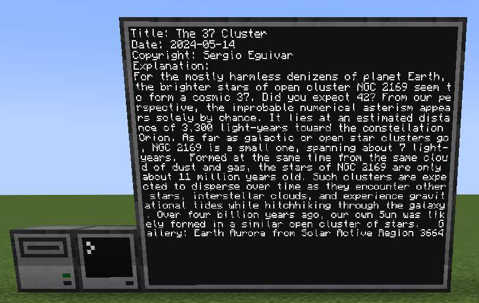

How cool would it be if i can use a api to get data and show it in minecraft?

Well, that is what i asked myself. So i made this.

What it is: A simple program that uses the nasa apod api to fetch the daily info about a place in the universe written by nasa.

To use this code without changing anything(except the api key) you need a computer in game and to the right a screen at the size you prefer(mine is 5x4)

