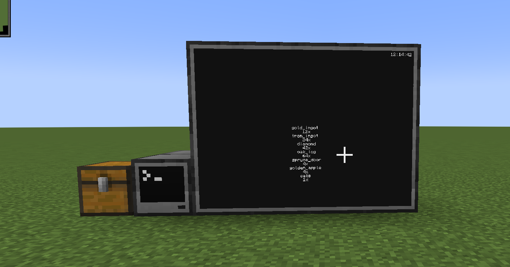

# Chest monitor

This program is used to see what items are in a chest that is attached to the computer to the left side while the monitor is to the right

With a nice little touch in the top right corner. there is a clock that shows the current time. and refreshes every 5 seconds(the same as the text for the chest monitor)

## How to use this?
run install.lua in your computer and watch the magic happen